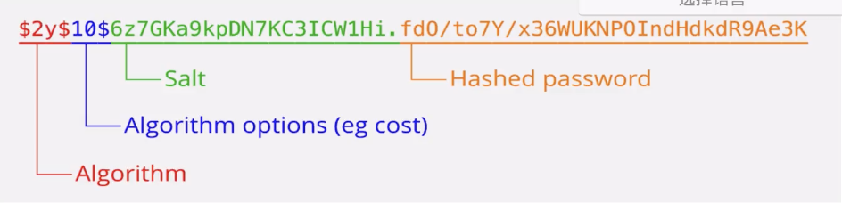

### 加密目前的选择方案

**1.明文保存plantext** - 坚决不能使用

```javascript
    username: viking
    password: 123
```

**2.md5 hash保存** - 碰撞，彩虹表

```javascript
    MD5('123') = 202CB962AC59075B96407152D234B70
    username: viking
    password: 202CB962AC59075B96407152D234B70
```

**3.md5 hash + salt(盐) 保存**
盐（Salt）,在密码学中，是指在hash之前将明文内（例如：密码）的任意
固定位置插入特定的字符串。

```javascript
    MD5('123'+ 'lck12b13k1jmjxrg1h0129h21j') = '6c2eef52be7911b6f3bcf0f672c96ce'
    username: viking
    password: 6c2eef52be7911b6f3bcf0f672c96ce
```

**4.byrypt**
一种加盐的单Hash,不可逆的加密算法，同一种明文（plaintext),每次加密后的密
文都不一样，而且不可反向破解生成明文，破解难度很大。
node.js实现- https: //github.com,/kelektiv/node.brcypt.js

```javascript
    bcrypt('123') = 
    $2b$1069SrwAoAUNC5F.gtLEvrNON6VQ5EX89vNqLEqU655Oy9Pet
    username: viking
    password: $2b$1069SrwAoAUNC5F.gtLEvrNON6VQ5EX89vNqLEqU655Oy9Pet
```


