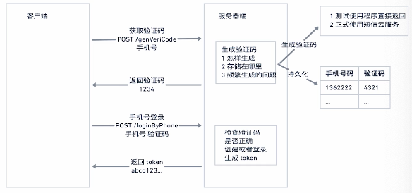

### 使用手机验证码登录

**基本流程**

**关于持久化的需求**

* 速度要快
* 操作简单
* 有自动的过期删除机制

**使用Redis**

址址：[https://redis.io]()

开源的，高性能的key-value数据库

**特点**

* 默认运行在内存中，也可以持久化到硬盘。
* 性能极搞读：110000次/s 写81000次/s
* 支持更复杂的数据结构: list, set, zset, hash 等
* 丰富的特性-还支持 原子操作，publish/subscribe, 通知，key 过期等等特性
