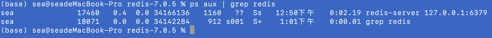

* 第一步下载redis.源码安装

```javascript
sudo curl -O https://github.com/redis/redis/archive/7.0.5.tar.gz
```

* 第二步下解压并修改目录所者

```javasctipt
sudo tar -zxvf 7.0.t.tar.gz

sudo chwon -R sea redis-7.0.5
```

* 第三步开始编译安装

```javascript
cd redis-7.0.5
make install
```

* 第四编辑启动配置文件并cp redis.conf /usr/local/etc/redis.conf

```javascript
vi redis.conf (注意 no 改 yes)
 304 ################################# GENERAL #####################################
 305 
 306 # By default Redis does not run as a daemon. Use 'yes' if you need it.
 307 # Note that Redis will write a pid file in /var/run/redis.pid when daemonized.
 308 # When Redis is supervised by upstart or systemd, this parameter has no impact.
 309 daemonize yes

```

* 第五启动行，并检查在后台是否有启动

```javascript
redis-server /usr/local/etc/redis.conf

ps aux | grep redis
```


