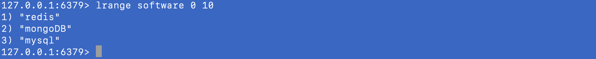
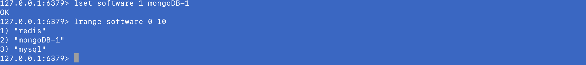

#### Redis Cli

```bash

# 基本语法
COMMAND KEY_NAME (VALUE)

# 数据类型为字符串 https://redis.io/commands#string

set name kevin   添加，修改
get name # kevin 查询
del name         删除

# 数据类型为列表
lpush software redis  #从数组左边插入元素
rpush software mongo  #从数组右边插入元素
lrange software 0 10  #查看列表0 ～ 10 元素
llen software         #查看列表长度
```



```bash
lset software 1 mongoDB-1
lrange software 0 10
```



```bash
lpop software 1   # 从左侧删第一个元素redis
rpop software 1   # 从右侧删第一个元素mysql
 
```

#### 关於Hash操作

hmset person name "kakeba" age 30 # 添加 name: "kakeba" age: 30 的hash 键值对
hgetall person # 打印person所有键值对
hmset person name "kevin" #修改person.name = "kevin"
hget person age # 查询 person.age = 30
hdel person hobby #删除person.hobby
