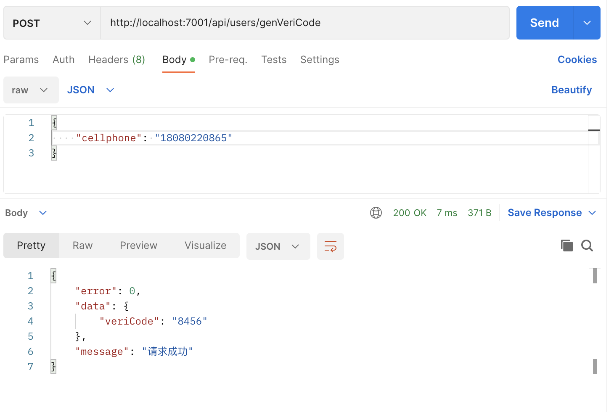
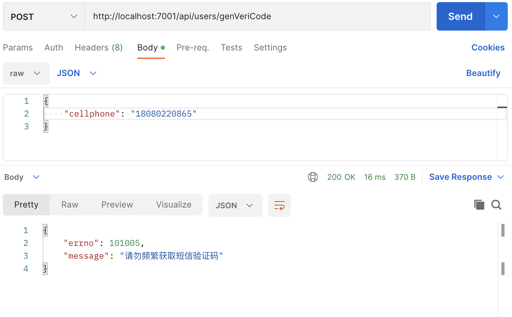

**1.安装egg-redis 插件**

```bash
npm install --save egg-redis
```

**2.在plugin.ts中配置启用**

```javascript
redis: {
  enable: true,
  package; 'egg-redis'
}
```

**3.在config.default.ts中配置redis连接**

```javascript
config.redis = {
  client: {
    prot: 6379,
    host: '127.0.0.1',
    password: '',
    db: 0
  }
}
```

**4.手机验证码输入检查规则**

```javascript
// 手机号输入验证规则
const sendCodeRules = {
  cellphone: {
    type: 'string',
    format: /^1[3-9]\d{9}$/,
    message: '手机号码格式错误',
  },
};
```

**5.发送短信验证码过于频繁**

```javascript
  // 发送短信验证码过于频繁
  sendVeriCodeFrequentlyFailInfo: {
    errno: 101005,
    message: '请勿频繁获取短信验证码',
  },
```

**6.发送手机验证码业务逻辑**

```javascript
  async sendVeriCode() {
    const { ctx, app } = this;
    const { cellphone } = ctx.request.body;
    // 检查用户输入
    const error = this.vaildateUserInput(sendCodeRules);
    if (error) {
      return ctx.helper.error({ ctx, errorType: 'userValidateFail', error });
    }
    // 获取 redis 的数据
    // phoneVeriCode-18080220865
    const preVeriCode = await app.redis.get(`phoneVeriCode-${cellphone}`);
    console.log(preVeriCode);
    // 判断是否存在
    if (preVeriCode) {
      return ctx.helper.error({
        ctx,
        errorType: 'sendVeriCodeFrequentlyFailInfo',
      });
    }
    // 创建随机4位数的手机验证码
    // [0 - 1]
    // [0 - 1] * 9000 = [0 - 9000]
    // [(0 - 9000) + 1000 = [1000, 10000]
    const veriCode = Math.floor(Math.random() * 9000 + 1000).toString();
    // 模拟发送手机验码60秒内有效
    await app.redis.set(`phoneVeriCode-${cellphone}`, veriCode, 'ex', 60);
    ctx.helper.success({ ctx, res: { veriCode } });
  }
```

**7.设置路由进行调用测试**

```javascript
  // 生成手机验证码
  router.post('/api/users/genVeriCode', controller.user.sendVeriCode);
```




