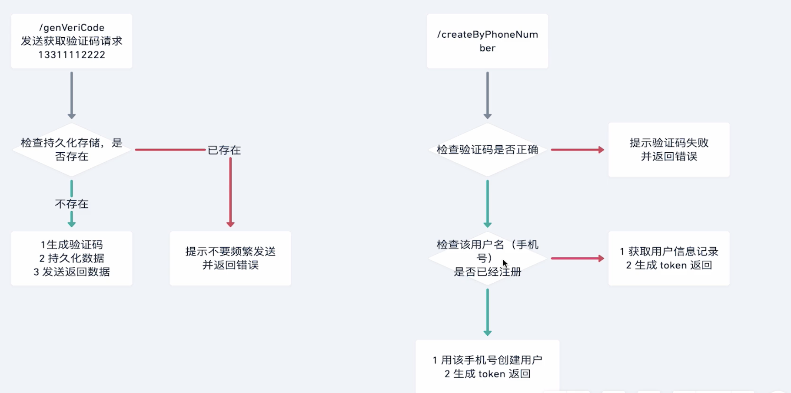

**1.修必用户model**

* 在模型添加字段 **[type]()** 用来区分是手机注册还是邮箱注册

```javascript
export interface UserProps {
  username: string;
  password: string;
  email?: string;
  nickName?: string;
  picture?: string;
  phoneNumber?: string;
  createdAt: Date;
  updatedAt: Date;
  type: 'email' | 'cellphone';
}
```

### 手机注册流程


