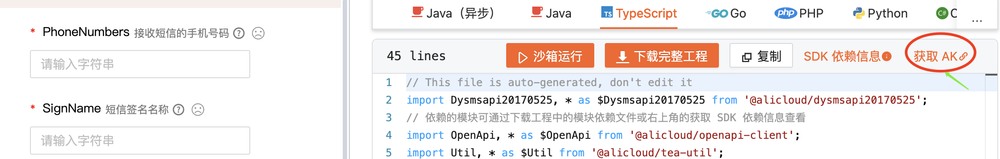
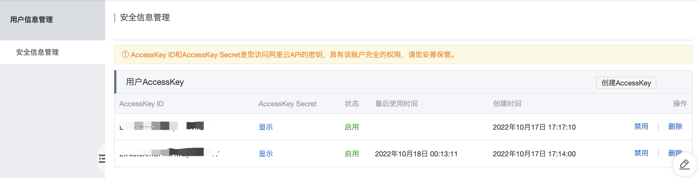

**1.第一步确定义自己阿里云**AK



**如果没有需要自己创建新的（AccessKey ID AccessKey Secret)**



**2.** 安装阿里云SDK 依赖：

```bash
npm install @alicloud/dysmsapi20170525@2.0.22
```

**3.在config.default.ts定义配置:**

```ts
  // add your special config in here
  const bizConfig = {
    sourceUrl: `https://github.com/eggjs/examples/tree/master/${appInfo.name}`,
    myLogger: {
      allowedMethod: [ 'POST' ],
    },
    aliCloudConfig: {
      accessKeyId: 'your accessKeyId',
      accessKeySecret: 'your accessKeySecret',
      endpoint: 'dysmsapi.aliyuncs.com',
    },
```

特别注意key不可写错了。而且需要保密

**4.要application.ts文件对app进行扩展一个[ALCLIENT]所属性，来统一调用阿里云客户端入口接入一个实例。**

目的是每次发信送不短信就用同一个实例（instace实例）

```javascript
import { Application } from 'egg';
import axios, { AxiosInstance } from 'axios';
import Dysmsapi20170525 from '@alicloud/dysmsapi20170525';
import * as $OpenApi from '@alicloud/openapi-client';
const AXIOS = Symbol('Application#axios');
const ALCLIENT = Symbol('Application#ALClient');
export default {
  // 扩展application 一个方法
  echo(msg: string) {
    const that = this as Application;
    return `hello${msg} ${that.config.name}`;
  },
  // 扩展application 一个属性
  get axiosInstance(): AxiosInstance {
    if (!this[AXIOS]) {
      this[AXIOS] = axios.create({
        baseURL: 'https://dog.ceo/',
        timeout: 5000,
      });
    }
    return this[AXIOS];
  },
  // 扩展application 一个【ALCLIENT】属性（项目启动自动实例阿里云入口一个客户端实例，供后面直接调用这个instance实例上方法）
  get ALClient(): Dysmsapi20170525 {
    const that = this as Application;
    const { accessKeyId, accessKeySecret } = that.config.aliCloudConfig;

    if (!this[ALCLIENT]) {
      const config = new $OpenApi.Config({
        accessKeyId,
        accessKeySecret,
      });
      config.endpoint = 'dysmsapi.aliyuncs.com';
      this[ALCLIENT] = new Dysmsapi20170525(config);
    }
    return this[ALCLIENT];
  },
};
```

**5.将调用的逻辑统封装service中**
```javascript
import * as $Dysmsapi20170525 from '@alicloud/dysmsapi20170525';
  // ...
  // 可里云短信云发送手机验证码
  async sendSMS(phoneNumber: string, veriCode: string) {
    const { app } = this;
    // 配置参数
    console.log(phoneNumber);
    console.log(veriCode);
    // 个用户学习使用，建使用的测试签名及模板。
    // 企业，网站/app 需要申请签名及模板
    // 注意学习测试也是需花几个块买200条3个月测试套餐。
    const sendSMSRequest = new $Dysmsapi20170525.SendSmsRequest({
      signName: '阿里云短信测试',
      templateCode: 'SMS_154950909',
      phoneNumbers: phoneNumber,
      templateParam: `{\"code\":\"${veriCode}\"}`,
    });
    console.log('测试1', sendSMSRequest);
    const resp = await app.ALClient.sendSms(sendSMSRequest);
    return resp;
  }
```
**6.在controller调service中的sendSMS()来发送验码。**
```javascript
    const veriCode = Math.floor(Math.random() * 9000 + 1000).toString();
    // 调用啊里云短信服务发送验码
    const resp = await this.service.user.sendSMS(cellphone, veriCode);

    if (resp.body.code !== 'OK') {
      return ctx.helper.error({ ctx, errorType: 'sendVeriCodeError' });
    }
    // 模拟发送手机验码60秒内有效
    await app.redis.set(`phoneVeriCode-${cellphone}`, veriCode, 'ex', 60);
    ctx.helper.success({ ctx, msg: '验证码发送成功' });
```
