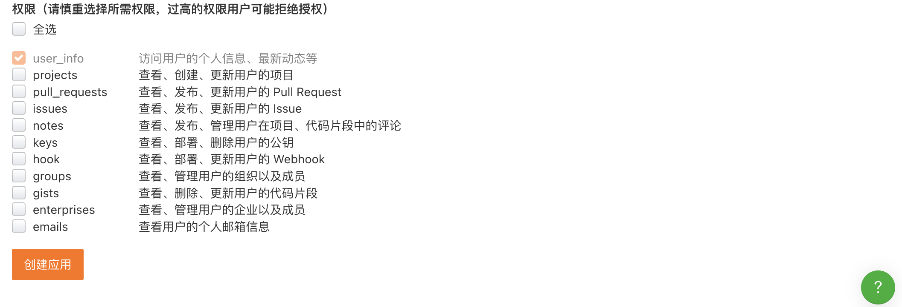
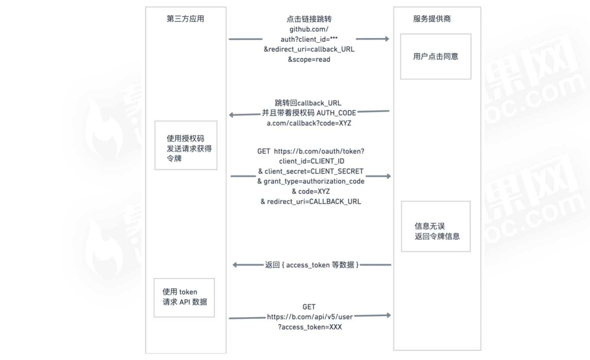

### 使用OAuth2完成用户登录

OAuth是一个关于授权(authorization)的开放网络标准，在全世界得到广泛用，

是用来授楷第三方应用。

**传统方式的缺陷**

* 为了后续的服务，会何存用户的密码，这样很不安全
* 没有恨制用户获得授权的范围和有效期
* 用户只有修改密码。才能收回赋予第三方应用的权力。
* 只要有一个第三方应用被破解，就会导致用户密码泄漏，以及所有被
  密码保护的数据泄漏。

**Oauth2的思路**

* OAuthd在【客户端】与【服务提供商之】，设置了一个授权层.

  （authorization）
* 客户端不能直接登录【服务提供商】，只能登录授权层，以此将用户
  区分开来。
* 【客户端】登录授权层所用令牌(token)，与用户的密码不同，用户可以在
  登录的进候，指定授权层令牌的权限范围和有效期。

**Token的优点：**

* 令牌是短期的，到期会自动失效，用户自己无法修改。
* 令牌可以被数据提供者撤销，会立限失效。
* 令牌有权限范围（scope）
  

**Oathu2的授权方式**

* 授权码（authorization-code)
* 隐藏式(implicit)
* 密码式（password)
* 客户端凭证（client credentials）

**授权码方式的工作流程**

