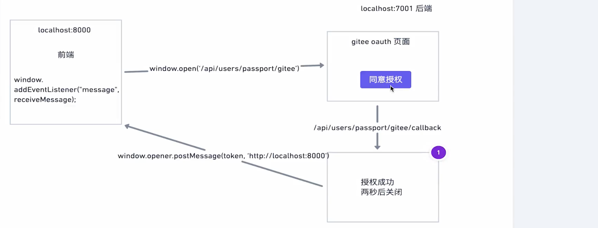

### window.postMessage

**window.postMessage()**方法可以安全地实现跨源通信，通常，对于两个不同页面的
脚本，只有当执行它们的页面位于具有相同的协议（通常为https),端口号（443为https的默认值）,
以及主机（两个页的模的模数Document.domain设置为相同的值）时，这两个脚本才能相互通信。
window.postMessage()方法提供了一种受控机制来规避此限制，只要正确的使用，这种方汉
就很安全。

从广义上讲，一个窗口可以对另一个窗口的引用（比如targetwindow = window.openr）,
然后在窗口上调用targetWindow.postMessage()方法分发一个MessageEvent消息。接
收消息的窗口可以根据需要自由处理此事件（en-US）.传递给window.postMessage()的
参数（比如message)**[将通过消息事件对象暴露给接收消息的窗口]()**。

