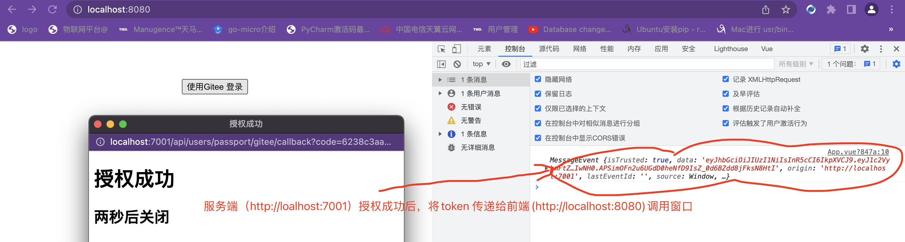

**1.第一步模拟前端在页面上创建一个Button按来触发调用Gitee授权页面的窗口**


创建一个vue的前项测试项目:

```vue
<template>
  <button @click="open">使用Gitee 登录</button>
</template>

<script lang="ts">
import { defineComponent, onMounted } from 'vue';

export default defineComponent({
  name: 'App',
  components: {},
  setup() {
    onMounted(() => {
      window.addEventListener('message', m => {
        console.log(m)
      })
    })
    const open = () => {
      window.open(
        'http://localhost:7001/api/users/passport/gitee',
        '_blank',
        'height=500,width=500,top=250,left=500'
      );
    };
    return {
      open
    }
  },
});
</script>

<style>
#app {
  font-family: Avenir, Helvetica, Arial, sans-serif;
  -webkit-font-smoothing: antialiased;
  -moz-osx-font-smoothing: grayscale;
  text-align: center;
  color: #2c3e50;
  margin-top: 60px;
}
</style>
```

**修改后端代码逻辑，原来是直接返回token, 改成渲染服务端页面**

* 添加模板文件success.nj

```nj
<!doctype html>
<html class="no-js" lang="">

<head>
  <meta charset="utf-8">
  <title>授权成功</title>
  <meta name="description" content="">
  <meta name="viewport" content="width=device-width, initial-scale=1">
</head>

<body>
  <h1>授权成功</h1>
  <h2>两秒后关闭</h2>
</body>
<script>
  window.onload = function() {
    setTimeout(() => {
      window.opener.postMessage('{{token}}','http://localhost:8080')
      window.close()
    }, 2000)
  }
</script>
</html>
```

* 在controller中调模板文件，并进行传参调用

```ts
  async oauthByGitee() {
    const { ctx } = this;
    const { code } = ctx.request.query;
    try {
      const token = await ctx.service.user.loginByGitee(code);
      // 调用后端模板页，把token传过去
      await ctx.render('success.nj', { token });
      // ctx.helper.success({ ctx, res: { token } });
    } catch (e) {
      return ctx.helper.error({ ctx, errorType: 'giteeOauthError' });
    }
  }

```

### 如图所示：


