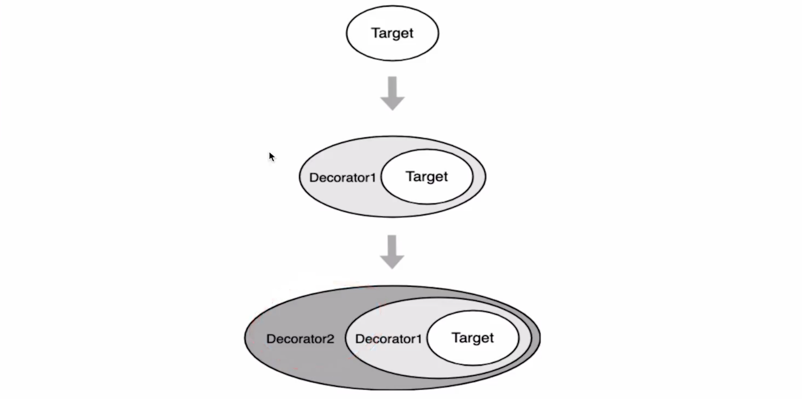

### 装饰器 Decorator

* 装饰器是一种特殊的声明，可以附加在类、方法、访问器、属性、参数声明上。
* 装饰器使用@expression的形式，其中exression必须能够演算为在运行时调用的
  的函数，其中包括装饰声明信息。**在不改对象自身的基础上，动态增加额外的
  职责。把对象核心职责各要装饰的功能分开了。非侵入式的行为修改。**

  

  **Typescript中的装饰器**
  TypeScript中的装饰器使用@expression这种形式，expression求值
  后为一个函数，**它在运行时被调用，被装饰的声明信会被做为参数传入**

  ```ts
  class Person {
    @time
    say() {
      console.log('hello')
    }
  }
  ```
