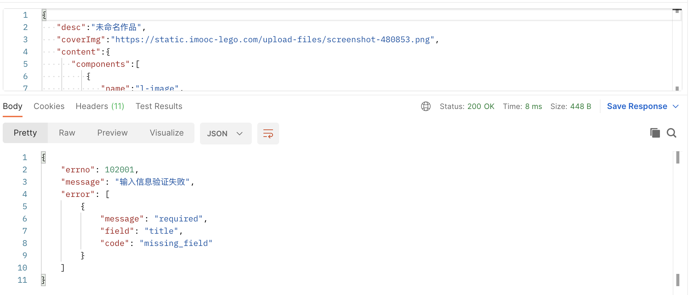

**1.新创建目录decorator中添inputValidate.ts**

```javascript
import { GlobalErrorTypes } from '../error';
import { Controller } from 'egg';
// 创建工厂函数传入 rules 和 errorType
export default function validateInput(rules: any, errorType: GlobalErrorTypes) {
  return function(_prototype, _key: string, descriptor: PropertyDescriptor) {
    const originalMethod = descriptor.value;
    descriptor.value = function(...args: any[]) {
      const that = this as Controller;
      // eslint-disable-next-line @typescript-eslint/ban-ts-comment
      // @ts-ignore
      const { ctx, app } = that;
      const errors = app.validator.validate(rules, ctx.request.body);
      if (errors) {
        return ctx.helper.error({ ctx, errorType, error: errors });
      }
      return originalMethod.apply(this, args);
    };
  };
}

```

**2.修改原来在controller中的work.ts文件进行调用：**

```javascript
import { Controller } from 'egg';
import validateInput from '../decorator/inputValidate';
const workCreateRules = {
  title: 'string',
};

export default class WorkController extends Controller {
  @validateInput(workCreateRules, 'workValidateFail')
  async createWork() {
    const { ctx, service } = this;
    const workData = await service.work.createEmptyWork(ctx.request.body);
    ctx.helper.success({ ctx, res: workData });
  }
}

```


